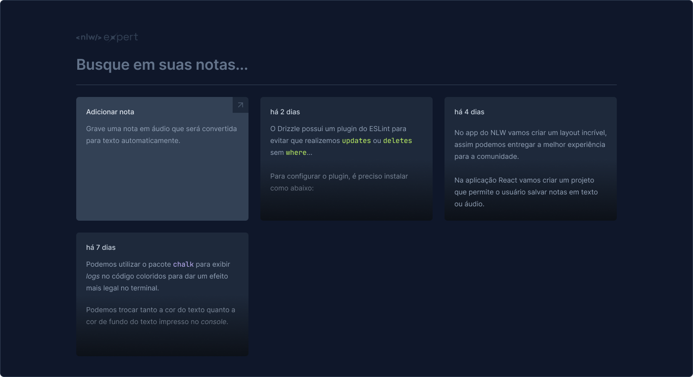

<h1 align="center">NLW Expert - Notes </h1>

O projeto consite na construção de uma aplicação Web que simula um bloco de notas e permite a possibilidade de gravarmoas anotações utilizando aúdio. Construído durante a semana da NLW com o Diego da  <a href="https://www.rocketseat.com.br/"> Rocketseat</a>.

## Súmario

- [📦 Temas abordados](#topics)
- [🏆 Sobre](#sobre)

<h2 id="features">✨ Features </h2>

- React
- HTML
- CSS
- Tailwind css
- Responsividade
- JavaScript
- Vite

<h2 id="sobre">🏆 Sobre</h2>

Como desafio durante essa semana foi construído nossa aplicação Web que permite fazer anotações simulando um bloco de notas, para fazer a construção do projeto foi utilizado o Vite + React, o projeto possuí responsividade na qual aplicamos os conceitos de mobile first usando o Tailwind css.